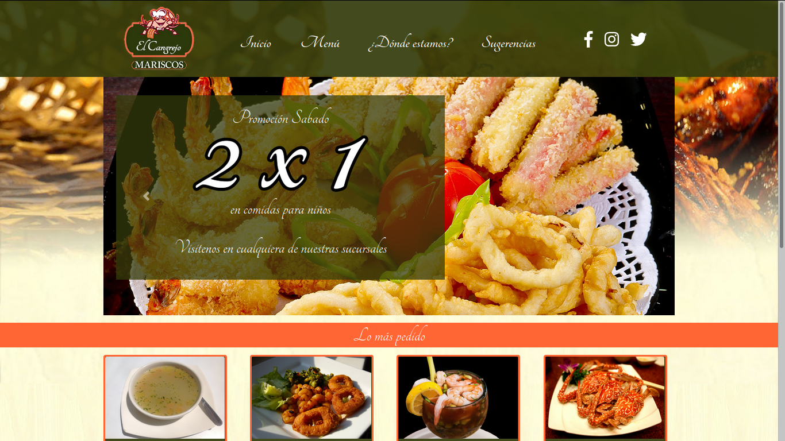
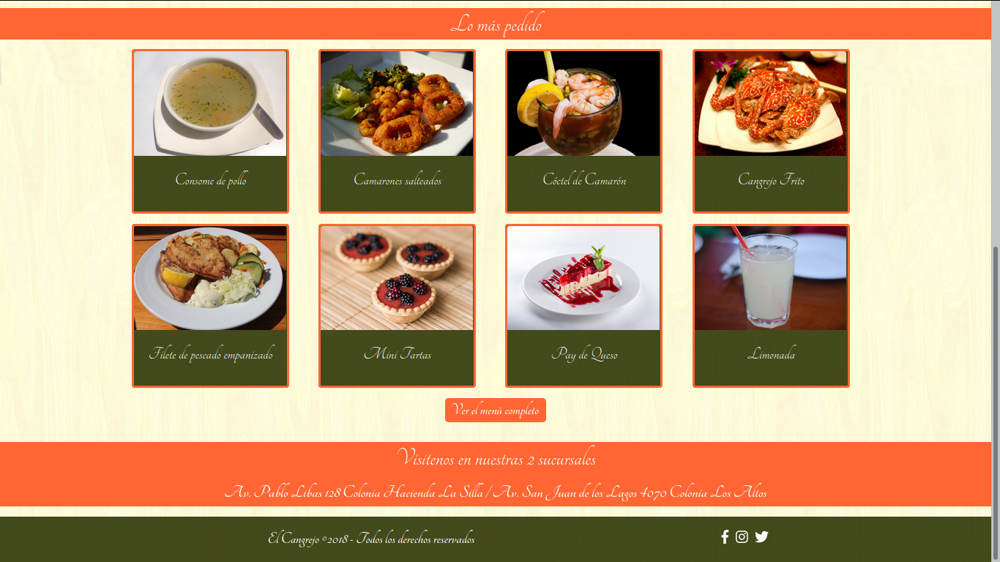

# Proyecto Mariscos

Esto fue un proyecto durante mi etapa de estudiante para la asignatura de Interfaces Computacionales. Para realizar el proyecto utilicé:

    * HTML
    * Bootstrap
    * CSS
    * JQuery

## Imagenes del proyecto

#### Página de inicio

#### Página del menú

#### Página de direcciones

#### Página de sugerencias

## Recursos visuales

Las imagenes fueron obtenidas de [Pixabay](https://pixabay.com/ "Pixabay").

Los íconos fueron obtenidos de [FontAwesome](https://fontawesome.com/ "FontAwesome").
